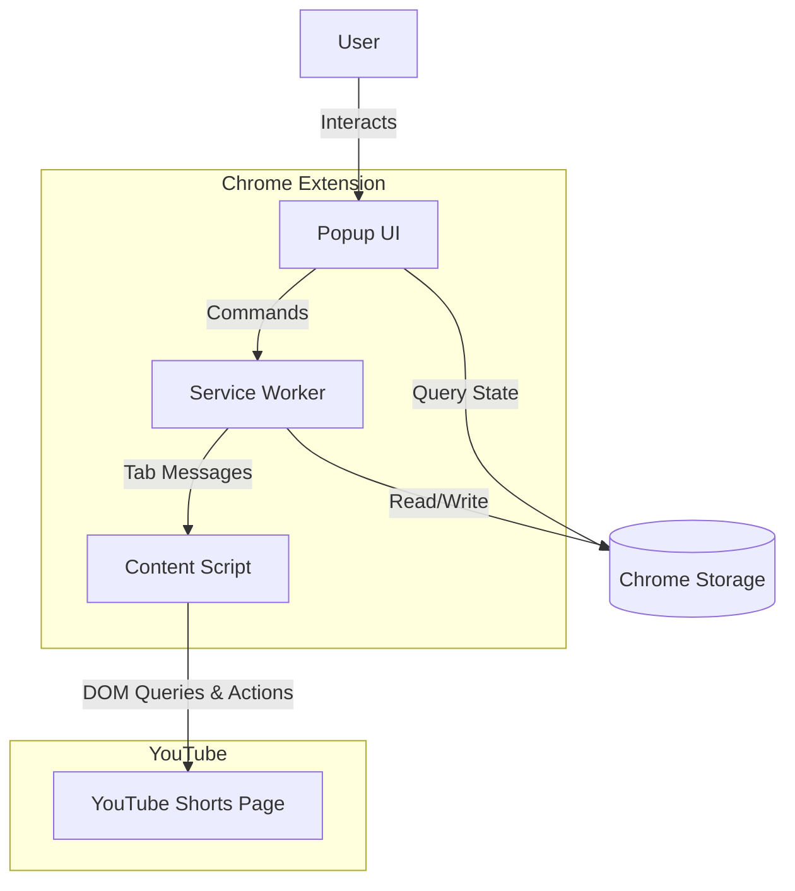
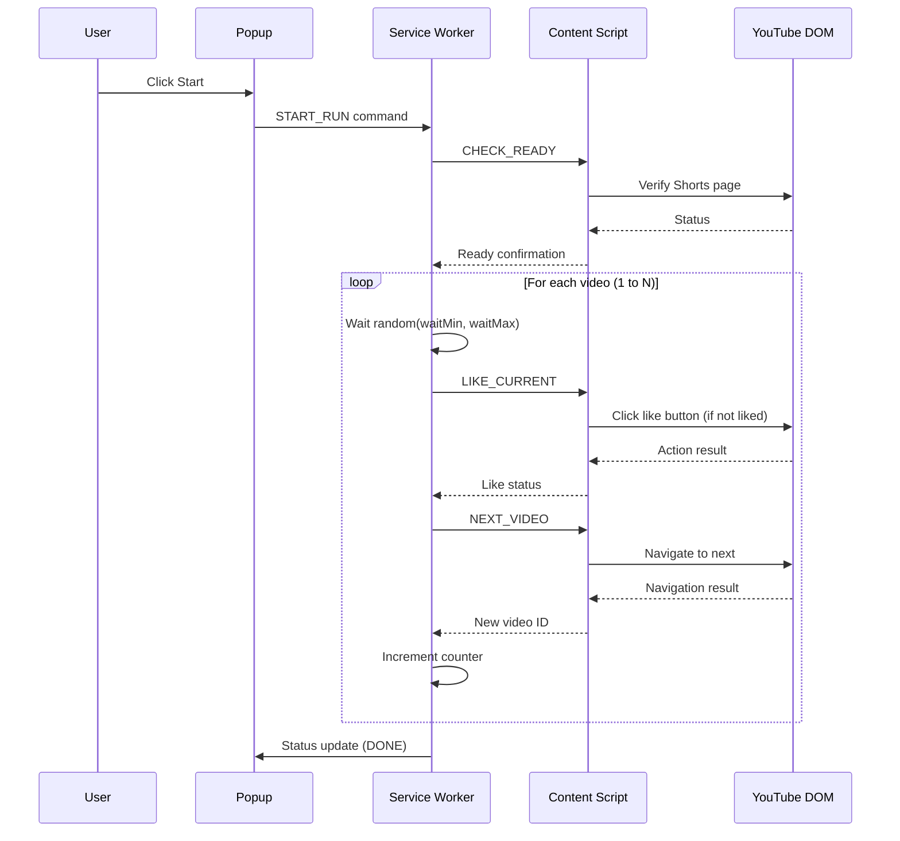
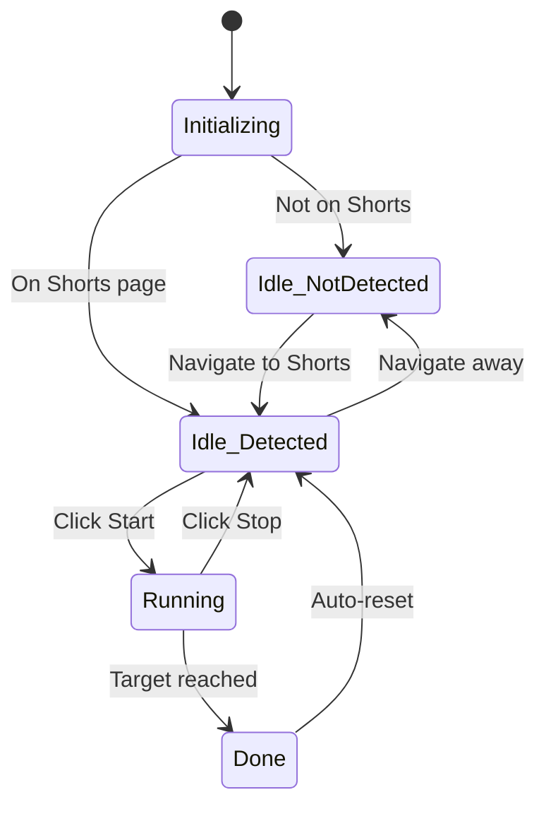
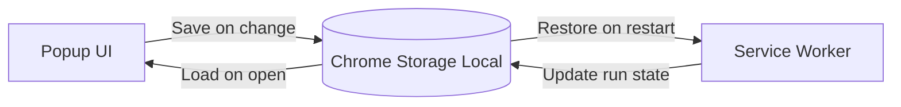
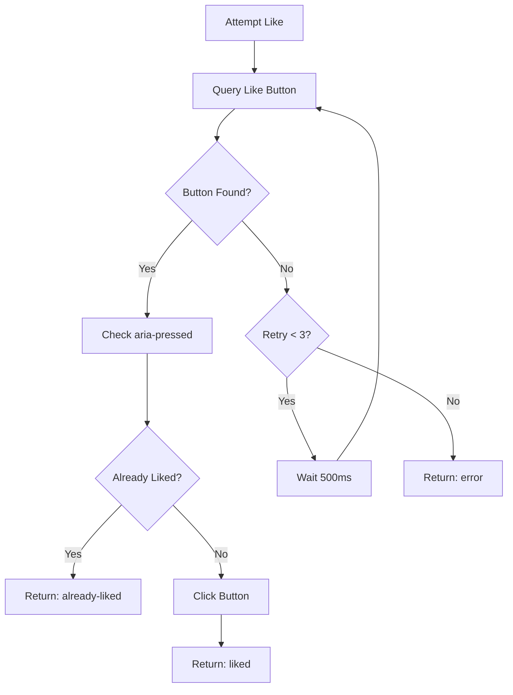
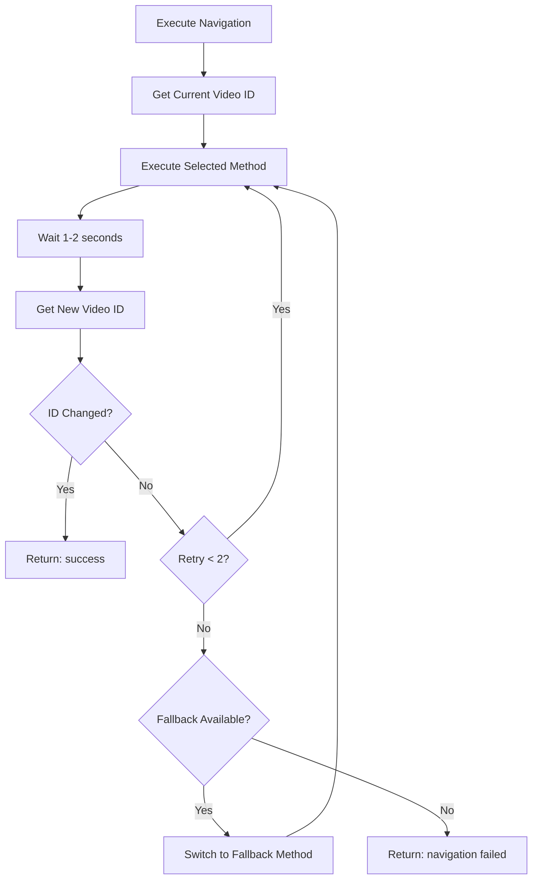
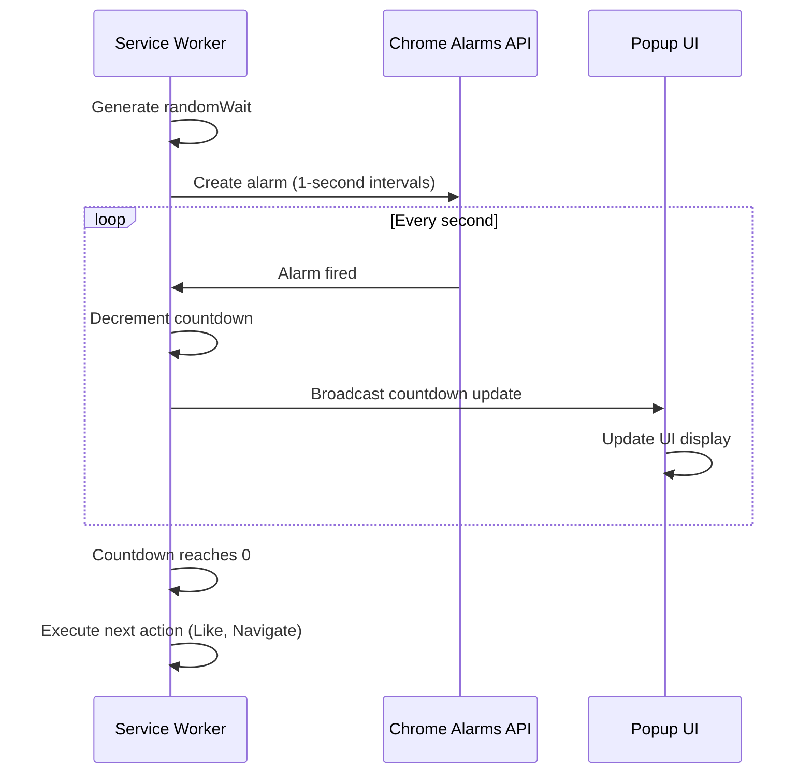
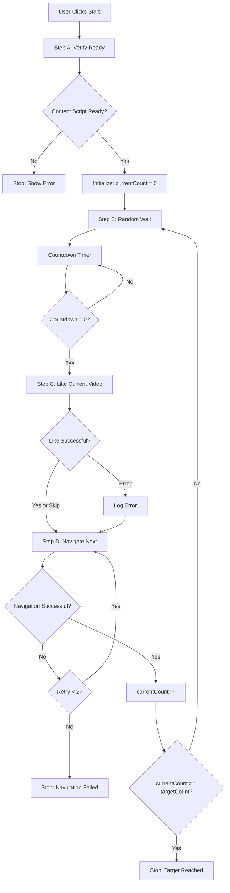
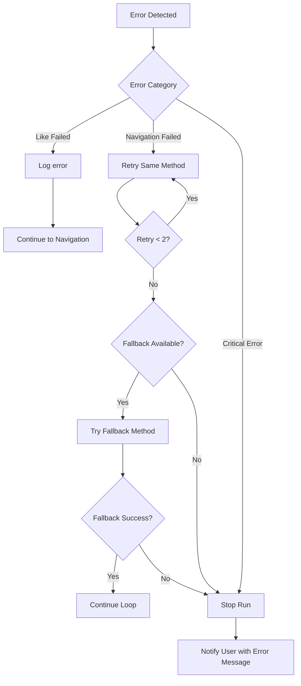
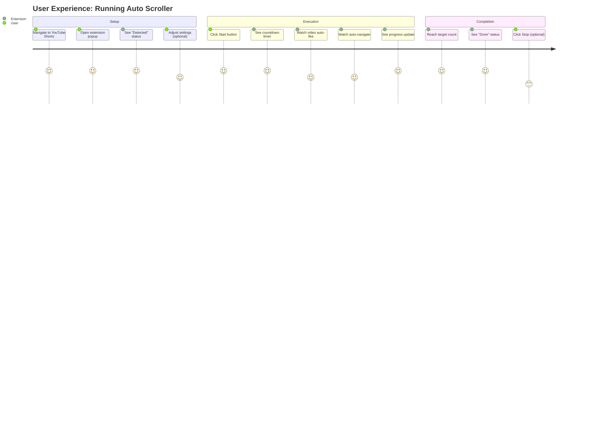

# Design Document: Auto YouTube Shorts Scroller & Liker

## 1. Purpose and Objectives

### 1.1 Purpose
This Chrome extension automates the process of watching, liking, and navigating through YouTube Shorts videos. The system enables users to define a target number of videos to process, with configurable wait times and navigation methods.

### 1.2 Primary Objectives
- Detect and verify YouTube Shorts page context
- Automate video navigation with configurable timing
- Conditionally apply likes to videos not already liked
- Provide user control over automation flow with real-time status feedback
- Persist user preferences across sessions

### 1.3 Risk Acknowledgment
This extension automates user interactions that may conflict with YouTube's Terms of Service. Users must acknowledge and accept full responsibility for potential policy violations, account restrictions, or other consequences.

---

## 2. System Architecture

### 2.1 Component Overview

The extension follows Chrome Manifest V3 architecture with three primary components:

| Component | Type | Responsibility |
|-----------|------|----------------|
| Popup UI | User Interface | Collect user inputs, display status, control automation lifecycle |
| Service Worker | Background Script | Orchestrate automation flow, manage state, coordinate messaging |
| Content Script | Injected Script | Execute DOM interactions on YouTube Shorts pages |

### 2.2 Architecture Diagram



### 2.3 Communication Flow



---

## 3. Core Functional Components

### 3.1 YouTube Shorts Detection

#### Detection Strategy
The system employs a two-tier detection mechanism:

**Primary Detection: URL Pattern Matching**
- Match URL against pattern: `https://www.youtube.com/shorts/*`
- Extract video ID from URL path segment

**Secondary Detection: DOM Verification**
- Verify presence of Shorts-specific container elements
- Confirm existence of Like button and navigation controls
- Validate video player is active and loaded

#### Detection States

| State | Condition | Action |
|-------|-----------|--------|
| Detected | URL matches AND DOM validated | Enable Start button |
| Not Detected | URL does not match OR DOM incomplete | Disable Start, show instruction |
| Uncertain | URL matches but DOM not ready | Retry verification with timeout |

---

### 3.2 Popup User Interface

#### UI Element Specification

| Element | Type | Purpose | Validation |
|---------|------|---------|------------|
| Detection Indicator | Status Badge | Show Shorts page detection result | N/A |
| Target Videos | Number Input | Define how many videos to process | Must be ≥ 1 |
| Wait Min | Number Input (seconds) | Minimum wait time per video | Must be ≥ 1 |
| Wait Max | Number Input (seconds) | Maximum wait time per video | Must be ≥ waitMin |
| Navigation Method | Dropdown | Select navigation technique | One of: CLICK_DOWN, KEYBOARD_ARROW, WHEEL_SCROLL |
| Skip Already Liked | Checkbox | Toggle skip behavior | Boolean |
| Start Button | Action Button | Begin automation | Enabled only when Shorts detected |
| Stop Button | Action Button | Halt automation | Enabled only when running |
| Progress Display | Read-only Text | Show X / N completion | Auto-updated |
| Countdown Timer | Read-only Text | Show seconds until next action | Updates every second |
| Activity Log | Scrollable List | Display last 5-10 actions | Auto-scroll to latest |

#### UI State Transitions



---

### 3.3 State Management

#### Global State Schema

The service worker maintains the following state structure:

| Property | Type | Purpose |
|----------|------|---------|
| isRunning | Boolean | Indicates if automation is active |
| currentCount | Integer | Number of videos processed |
| targetCount | Integer | Total videos to process |
| countdown | Integer | Seconds remaining before next action |
| lastVideoId | String | ID of current/last video (for change detection) |
| waitMin | Integer | User-configured minimum wait |
| waitMax | Integer | User-configured maximum wait |
| navigationMethod | Enum | Selected navigation technique |
| skipAlreadyLiked | Boolean | Whether to skip liked videos |
| lastLogs | Array<String> | Recent action log entries |

#### State Persistence



**Storage Keys:**
- `settings`: User preferences (targetCount, waitMin, waitMax, navigationMethod, skipAlreadyLiked)
- `runState`: Runtime state (isRunning, currentCount, countdown, lastVideoId, lastLogs)

---

### 3.4 Like Action Logic

#### Like Button Detection Algorithm

The content script searches for the Like button using the following priority:

1. Query buttons with `aria-label` containing "like" (case-insensitive)
2. Within the Shorts action panel container
3. Filter by visibility and interactability

#### Like State Determination

| Condition | Attribute Check | Action |
|-----------|----------------|--------|
| Already Liked | `aria-pressed="true"` | Skip, log "Already liked" |
| Not Liked | `aria-pressed="false"` or absent | Click button, log "Liked" |
| Button Not Found | Query returns null/empty | Retry up to 3 times, then log error |

#### Like Action Response Format

The content script responds to the service worker with structured results:

**Success - Liked:**
- Status: `ok: true`
- Action: `liked: true`

**Success - Already Liked:**
- Status: `ok: true`
- Action: `liked: false`
- Reason: `"already-liked"`

**Failure:**
- Status: `ok: false`
- Error: `"LIKE_BUTTON_NOT_FOUND"` or other error code

#### Retry Strategy



---

### 3.5 Navigation Logic

#### Navigation Method Options

| Method | Implementation Strategy | Verification |
|--------|------------------------|--------------|
| CLICK_DOWN (Default) | Locate and click the "Next" or down arrow button in Shorts controls | Check URL or video ID changed |
| KEYBOARD_ARROW | Dispatch synthetic `ArrowDown` keyboard event to document | Check URL or video ID changed |
| WHEEL_SCROLL | Execute `window.scrollBy()` with vertical offset equal to viewport height | Check URL or video ID changed |

#### Navigation Execution Flow



#### Video ID Extraction

The content script extracts the current video ID by:
1. Parsing `window.location.pathname` for pattern `/shorts/<id>`
2. Extracting the `<id>` segment
3. Returning ID for comparison before/after navigation

#### Verification Timeout

Navigation verification times out after 5-8 seconds. If the video ID has not changed within this window, the navigation is considered failed and retry logic is triggered.

---

### 3.6 Timing and Delay Management

#### Random Delay Generation

For each video, the system generates a random wait duration:
- Formula: `randomWait = randomInt(waitMin, waitMax)` (inclusive)
- Purpose: Simulate human-like viewing patterns

#### Countdown Timer Implementation

The countdown mechanism operates as follows:



#### Alarm-Based Timing Rationale

Chrome Manifest V3 service workers are subject to inactivity termination. Using `chrome.alarms` API ensures:
- Timers persist across service worker sleep/wake cycles
- State is maintained in storage
- Countdown continues reliably even if popup is closed

---

### 3.7 Orchestration and Execution Loop

#### Step-Based Execution Model

The service worker coordinates automation through discrete steps:

| Step | Action | Success Transition | Failure Transition |
|------|--------|-------------------|-------------------|
| A: Verify Ready | Confirm content script loaded and Shorts page active | → Step B | → Stop run, show error |
| B: Wait Countdown | Execute random delay with timer | → Step C | N/A (uninterruptible) |
| C: Like Video | Execute like action via content script | → Step D | → Log error, proceed to Step D |
| D: Navigate Next | Execute navigation via content script | → Increment counter, check if done, repeat from Step B | → Retry up to 2 times, then stop |

#### Main Loop Flow



#### Stop Mechanism

When the user clicks Stop or an unrecoverable error occurs:
1. Cancel all active alarms
2. Set `isRunning = false`
3. Persist state to storage
4. Notify popup to update UI
5. Clear countdown timer

---

## 4. Data Structures

### 4.1 Message Protocol

#### Popup → Service Worker

| Message Type | Payload | Purpose |
|--------------|---------|---------|
| START_RUN | `{ targetCount, waitMin, waitMax, navigationMethod, skipAlreadyLiked }` | Initiate automation loop |
| STOP_RUN | None | Halt automation immediately |
| GET_STATUS | None | Request current run state for UI update |

#### Service Worker → Content Script

| Message Type | Payload | Purpose | Expected Response |
|--------------|---------|---------|------------------|
| CHECK_READY | None | Verify content script is loaded and page is valid Shorts page | `{ ready: true/false }` |
| GET_VIDEO_ID | None | Retrieve current video ID from URL | `{ videoId: string }` |
| LIKE_CURRENT | None | Execute like action on current video | `{ ok: boolean, liked: boolean, reason?: string, error?: string }` |
| NEXT_VIDEO | `{ method: string }` | Navigate to next video using specified method | `{ ok: boolean, newVideoId?: string, error?: string }` |

#### Service Worker → Popup

| Broadcast Event | Payload | Purpose |
|-----------------|---------|---------|
| STATUS_UPDATE | `{ isRunning, currentCount, targetCount, countdown, lastLogs }` | Update popup UI with current state |

### 4.2 Storage Schema

**Key: `settings`**
```
{
  targetCount: Integer (default: 20),
  waitMin: Integer (default: 15),
  waitMax: Integer (default: 30),
  navigationMethod: String (default: "CLICK_DOWN"),
  skipAlreadyLiked: Boolean (default: true)
}
```

**Key: `runState`**
```
{
  isRunning: Boolean (default: false),
  currentCount: Integer (default: 0),
  targetCount: Integer (copy from settings),
  countdown: Integer (default: 0),
  lastVideoId: String | null,
  lastLogs: Array<String> (max 10 entries)
}
```

---

## 5. Error Handling Strategy

### 5.1 Error Categories and Responses

| Error Type | Detection | Response Strategy |
|------------|-----------|------------------|
| Not on Shorts Page | URL pattern mismatch or DOM verification failure | Disable Start button, show instructional message |
| Content Script Not Ready | Message timeout or no response | Block start, suggest page refresh |
| Like Button Not Found | DOM query returns null after 3 retries | Log error, continue to navigation |
| Navigation Failure | Video ID unchanged after 2 retries and fallback | Stop run, notify user of navigation failure |
| Tab Closed/Navigated Away | Tab query returns invalid or URL changed | Stop run, notify user |

### 5.2 Error Recovery Decision Tree



### 5.3 Validation Rules

**Pre-Start Validation:**
- Target count must be ≥ 1
- Wait min must be ≥ 1
- Wait max must be ≥ wait min
- Current tab must be YouTube Shorts page
- Content script must respond to CHECK_READY

**Runtime Validation:**
- Before each action, verify tab still exists and is on Shorts
- Verify video ID changes after navigation
- Confirm countdown reaches 0 before next action

---

## 6. User Experience Flow

### 6.1 Typical User Journey



### 6.2 Activity Log Messages

The activity log displays concise, user-friendly messages:

| Event | Log Message Format |
|-------|--------------------|
| Video liked | `Video #X: Liked` |
| Already liked, skipped | `Video #X: Already liked, skipped` |
| Like failed | `Video #X: Like failed (error)` |
| Navigated to next | `→ Next video` |
| Navigation failed | `Navigation failed, retrying...` |
| Target reached | `✓ Completed N videos` |
| Stopped by user | `⊗ Stopped by user` |

Messages are prepended to the log array (newest first) and limited to the most recent 10 entries.

---

## 7. Extension Manifest Configuration

### 7.1 Required Permissions

| Permission | Justification |
|------------|---------------|
| `storage` | Persist user settings and run state across sessions |
| `activeTab` | Identify current tab URL for Shorts detection |
| `tabs` | Send messages to content script in active tab |
| `alarms` | Reliable countdown timers that survive service worker sleep |

### 7.2 Host Permissions

| Host Pattern | Purpose |
|--------------|---------|
| `https://www.youtube.com/*` | Execute content script and interact with YouTube pages |

### 7.3 Manifest Structure Overview

| Section | Key Elements |
|---------|--------------|
| Metadata | name, version, description, icons |
| Action | default_popup: popup.html |
| Background | service_worker: service_worker.js, type: module |
| Content Scripts | matches: `https://www.youtube.com/shorts/*`, js: content_script.js, run_at: document_idle |
| Permissions | storage, activeTab, tabs, alarms |
| Host Permissions | `https://www.youtube.com/*` |

---

## 8. Acceptance Criteria

### 8.1 Detection Criteria

| Criterion | Acceptance Test |
|-----------|----------------|
| Shorts page detected | When user navigates to `youtube.com/shorts/<any-id>`, popup shows "✅ YouTube Shorts detected" |
| Non-Shorts page handled | When user is on any other page, popup shows "❌ Not on Shorts page" and Start button is disabled |

### 8.2 Automation Flow Criteria

| Criterion | Acceptance Test |
|-----------|----------------|
| Start initiates loop | Clicking Start with target=5 begins processing videos 1 through 5 |
| Progress tracking | Progress display updates from "0 / 5" to "5 / 5" as videos are processed |
| Countdown accuracy | Countdown timer decrements every second from randomWait to 0 before each action |
| Auto-stop on completion | When currentCount reaches targetCount, automation stops and status shows "Done" |

### 8.3 Like Behavior Criteria

| Criterion | Acceptance Test |
|-----------|----------------|
| Like un-liked video | If video is not liked (aria-pressed=false), Like button is clicked and log shows "Liked" |
| Skip liked video | If video is already liked (aria-pressed=true), Like button is not clicked and log shows "Already liked, skipped" |
| No unlike action | System never unlikes a video, even if skipAlreadyLiked is false |

### 8.4 Navigation Criteria

| Criterion | Acceptance Test |
|-----------|----------------|
| Primary method success | Using CLICK_DOWN method successfully changes video ID to next video |
| Fallback on failure | If primary method fails twice, system attempts fallback method |
| Stop on total failure | If all methods fail after retries, automation stops and error is displayed |

### 8.5 Control Criteria

| Criterion | Acceptance Test |
|-----------|----------------|
| Stop halts immediately | Clicking Stop button cancels countdown, clears alarms, and stops all automation |
| Settings persistence | Closing and reopening popup restores previously configured settings |

---

## 9. Non-Functional Requirements

### 9.1 Performance Targets

| Metric | Target |
|--------|--------|
| Popup open time | < 200ms |
| Content script readiness check | < 1s timeout |
| Like button detection | < 500ms per attempt |
| Navigation verification | 5-8s timeout |
| UI status update frequency | 1s (aligned with countdown) |

### 9.2 Reliability Requirements

- Automation must survive service worker sleep/wake cycles
- State must persist across extension restarts
- UI must remain responsive during automation
- Errors must not crash the extension

### 9.3 Usability Requirements

- All settings must have sensible defaults
- UI must clearly indicate current state (idle/running/done)
- Error messages must be user-friendly and actionable
- Countdown timer provides clear feedback on next action timing

---

## 10. Disclaimer and Policy Compliance

### 10.1 User Acknowledgment

The extension must display a prominent disclaimer before first use:

**Disclaimer Content:**
> This extension automates interactions with YouTube that may violate YouTube's Terms of Service. Use of this extension is entirely at your own risk. You accept full responsibility for any consequences, including but not limited to account restrictions, suspensions, or bans. The developers assume no liability for any outcomes resulting from use of this extension.

### 10.2 Compliance Measures

- No silent or automatic execution without explicit user action (Start button)
- No data collection, scraping, or analytics
- No obfuscation or anti-detection techniques
- Clear indication that automation is user-initiated and user-controlled
- Ability to stop automation at any time

---

## 11. Future Enhancement Considerations

The following features are out of scope for MVP but may be considered for future versions:

- Pause automation when tab loses focus or becomes hidden
- Keyboard shortcuts using Chrome Commands API
- Configurable retry limits and timeout durations
- Export activity logs
- Statistics dashboard (total videos processed, success rate)
- Multiple profile support for different settings presets
- Integration with YouTube playlists or specific channels
| Popup open time | < 200ms |
| Content script readiness check | < 1s timeout |
| Like button detection | < 500ms per attempt |
| Navigation verification | 5-8s timeout |
| UI status update frequency | 1s (aligned with countdown) |

### 9.2 Reliability Requirements

- Automation must survive service worker sleep/wake cycles
- State must persist across extension restarts
- UI must remain responsive during automation
- Errors must not crash the extension

### 9.3 Usability Requirements

- All settings must have sensible defaults
- UI must clearly indicate current state (idle/running/done)
- Error messages must be user-friendly and actionable
- Countdown timer provides clear feedback on next action timing

---

## 10. Disclaimer and Policy Compliance

### 10.1 User Acknowledgment

The extension must display a prominent disclaimer before first use:

**Disclaimer Content:**
> This extension automates interactions with YouTube that may violate YouTube's Terms of Service. Use of this extension is entirely at your own risk. You accept full responsibility for any consequences, including but not limited to account restrictions, suspensions, or bans. The developers assume no liability for any outcomes resulting from use of this extension.

### 10.2 Compliance Measures

- No silent or automatic execution without explicit user action (Start button)
- No data collection, scraping, or analytics
- No obfuscation or anti-detection techniques
- Clear indication that automation is user-initiated and user-controlled
- Ability to stop automation at any time

---

## 11. Future Enhancement Considerations

The following features are out of scope for MVP but may be considered for future versions:

- Pause automation when tab loses focus or becomes hidden
- Keyboard shortcuts using Chrome Commands API
- Configurable retry limits and timeout durations
- Export activity logs
- Statistics dashboard (total videos processed, success rate)
- Multiple profile support for different settings presets
- Integration with YouTube playlists or specific channels
|--------|--------|
| Popup open time | < 200ms |
| Content script readiness check | < 1s timeout |
| Like button detection | < 500ms per attempt |
| Navigation verification | 5-8s timeout |
| UI status update frequency | 1s (aligned with countdown) |

### 9.2 Reliability Requirements

- Automation must survive service worker sleep/wake cycles
- State must persist across extension restarts
- UI must remain responsive during automation
- Errors must not crash the extension

### 9.3 Usability Requirements

- All settings must have sensible defaults
- UI must clearly indicate current state (idle/running/done)
- Error messages must be user-friendly and actionable
- Countdown timer provides clear feedback on next action timing

---

## 10. Disclaimer and Policy Compliance

### 10.1 User Acknowledgment

The extension must display a prominent disclaimer before first use:

**Disclaimer Content:**
> This extension automates interactions with YouTube that may violate YouTube's Terms of Service. Use of this extension is entirely at your own risk. You accept full responsibility for any consequences, including but not limited to account restrictions, suspensions, or bans. The developers assume no liability for any outcomes resulting from use of this extension.

### 10.2 Compliance Measures

- No silent or automatic execution without explicit user action (Start button)
- No data collection, scraping, or analytics
- No obfuscation or anti-detection techniques
- Clear indication that automation is user-initiated and user-controlled
- Ability to stop automation at any time

---

## 11. Future Enhancement Considerations

The following features are out of scope for MVP but may be considered for future versions:

- Pause automation when tab loses focus or becomes hidden
- Keyboard shortcuts using Chrome Commands API
- Configurable retry limits and timeout durations
- Export activity logs
- Statistics dashboard (total videos processed, success rate)
- Multiple profile support for different settings presets
- Integration with YouTube playlists or specific channels
